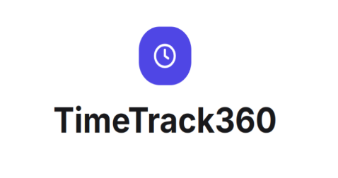
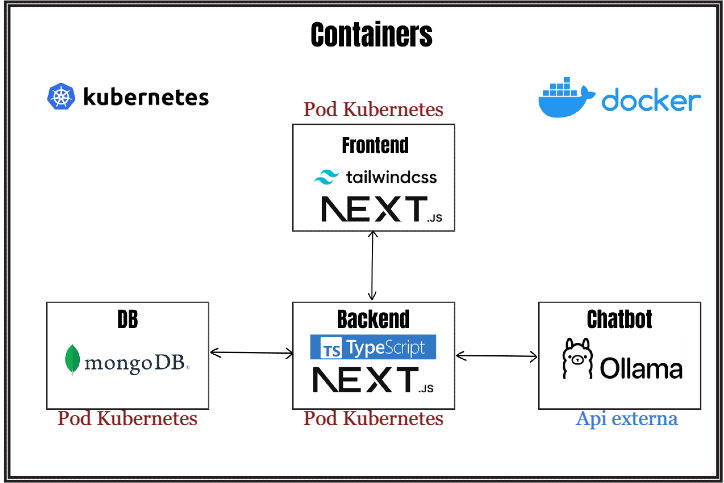

  

# Introducció

El propòsit d'aquest projecte és oferir una plataforma per al registre de la jornada laboral i la gestió d'absències i permisos, pensada per a empreses i organitzacions que necessiten un sistema senzill, auditable i escalable. Aquest document no solament explica com utilitzar-la, sinó què és el projecte, per a què serveix i com està organitzat a nivell arquitectònic i d'objectius.

## Objectius del projecte

- Dissenyar i implementar una solució client-servidor per al registre de jornada.
- Proveir historial i traçabilitat de les marques de temps (check-in / check-out).
- Facilitar la gestió de vacances i permisos amb fluxos d'aprovació.
- Permetre l'organització d'usuaris per grups i rols administratius.
- Preparar la solució per al desplegament amb contenidors i orquestració (Docker, Kubernetes).

## Enfocament i mètode seguit

El desenvolupament es va organitzar en components independents que es van crear en paral·lel i es van integrar posteriorment. Es va seguir un enfoc pragmàtic:

- Components desacoblats (frontend, backend, base de dades) amb APIs ben definides.
- Desenvolupament i proves locals mitjançant `docker-compose` per a reproductibilitat.
- Scripts de seed i tests automatitzats per validar dades inicials i endpoints.
- Integració progressiva: primer les crides a la base de dades, després els endpoints principals i finalment la interfície d'usuari.

Per a les proves d'integració s'ha utilitzat una xarxa aïllada (entorns locals o VPN) que simula les connexions entre components.

## Arquitectura del projecte

L'arquitectura està composta per tres blocs principals: frontend (interfície i panell administratiu), backend (API i lògica de negoci) i la base de dades. A més, hi ha codi compartit per a tipus i esquemes. El projecte està preparat per a executar-se en contenidors i disposa de manifests de Kubernetes a `k8s/`.

  

### Chatbot / Assistant

Aquest repositori inclou un servei de chatbot que permet interaccions conversacionals amb la informació del sistema (historial de marques, estat d'empleats, sol·licituds de vacances, etc.). Components i fitxers rellevants:

- **Frontend**: `frontend/app/(tabs)/chat/page.tsx` — interfície d'usuari per enviar missatges i conservar l'historial localment (clau `chat_history_{email}` a `localStorage`).
- **Backend (API)**: `backend/src/pages/api/chat.ts` — rep les peticions POST del frontend, construeix el context amb dades filtrades de la BD i crida l'API del model.
- **Prompts i configuració**: `backend/src/lib/chatbotPrompts.ts` — missatges del sistema i comportament esperat del bot.

Variables d'entorn importants per al servei de chatbot:

- `GROQ_API_KEY` — clau API usada per cridar l'endpoint d'AI configurat (`https://api.groq.com/...`).
- `LLAMA_MODEL` — nom del model a utilitzar (per defecte `llama-3.1-8b-instant` si no es configura).
- `MONGODB_URI` — connexió a la base de dades per generar context personalitzat.

Notes d'ús en desenvolupament:

1. Configura les variables d'entorn anteriors (per exemple, en `.env`) abans d'arrencar el backend.
2. Executa el backend i el frontend amb `npm run dev` a cadascuna de les carpetes (`backend/`, `frontend/`) o utilitza `docker-compose up --build`.
3. Des del frontend, obre la pestanya "Chatbot" i envia un missatge; el backend retornarà una resposta basada en el context (i el model extern configurat).

Aquest servei està integrat i provat dins del projecte; la nota anterior que indicava "no aplicable" s'ha substituït per aquesta descripció precisa del chatbot.

## Components

### Backend

Implementat amb Node.js i exposa una API REST per a totes les operacions del sistema:

- Gestió d'autenticació i autorització.
- Endpoints per a registres de jornada i sessions de treball.
- CRUD per a usuaris, grups i sol·licituds de vacances.
- Integració amb la base de dades (MongoDB) i scripts d'inicialització.

El codi del backend es troba a la carpeta `backend/`.

### Frontend

Interfície construïda amb Next.js (carpeta `frontend/`) que inclou:

- Pàgina d'usuari amb registre de jornada i visualització d'historial.
- Panell administratiu per gestionar usuaris, grups i sol·licituds.
- Components reutilitzables i estils centralitzats.

### Base de dades

S'utilitza MongoDB per emmagatzemar usuaris, marques temporals, sol·licituds de vacances i configuracions. La configuració i scripts d'inicialització estan a `database/`.

### Contenidors i orquestració

S'inclou un `docker-compose.yml` a la arrel per a desenvolupament i proves locals. Per a desplegaments en clúster es proporcionen manifests a `k8s/` (ajustar secrets i volums segons l'entorn).

## Flux bàsic d'ús (conceptual)

1. L'empleat realitza un check-in o check-out des de la interfície web.
2. La petició arriba al backend, que la valida i la persisteix a la base de dades.
3. Les sol·licituds de vacances es gestionen mitjançant fluxos d'aprovació des del panell administratiu.

## Dades d'exemple

Existeix un script de seed per carregar usuaris d'exemple: `backend/seed_users.js`.

## Variables d'entorn rellevants

- `MONGODB_URI` — URI de connexió a MongoDB.
- `PORT` — Port en què escolta el backend.
- `NEXT_PUBLIC_API_URL` — URL de l'API exposada al frontend.

Comprova `backend/.env.example` i `frontend/.env.example` si estan disponibles.